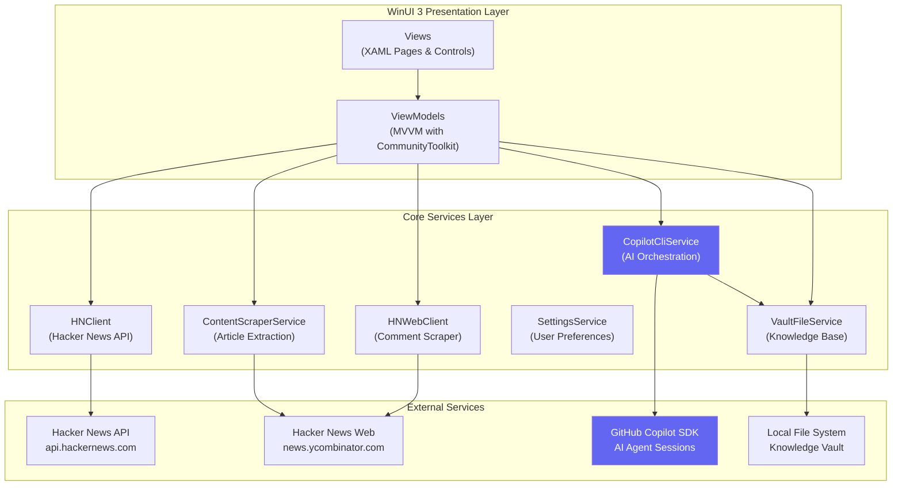

# HN Reader


A modern Hacker News reader for Windows, powered by **GitHub Copilot CLI** for AI-generated insights and personalized news digests.


<figure>
  
</figure>

## Features

- **AI-Powered Insights** — Generate structured analysis of stories and discussions using GitHub Copilot
- **Personalized News Digest** — AI-curated daily digest based on your configured interests
- **Browse Hacker News** — View Top, New, Best, Ask HN, and Show HN stories
- **Favorites** — Save stories for later reading
- **Modern UI** — WinUI 3 design with light/dark theme support

## Architecture



## Getting Started

### Prerequisites

- **Windows 10/11** (version 1809 or later)
- **.NET 8.0 SDK** — [Download](https://dotnet.microsoft.com/download/dotnet/8.0)
- **GitHub Copilot CLI** — Required for AI features. [Installation guide](https://docs.github.com/en/copilot/concepts/agents/about-copilot-cli)
- **Visual Studio 2022** (recommended) with:
  - .NET Desktop Development workload
  - Windows App SDK

### Build & Run

```powershell
# Clone the repository
git clone https://github.com/ZadokJoshua/hn-reader.git
cd hn-reader/HNReaderApp

# Restore dependencies
dotnet restore

# Build the solution
dotnet build

# Run the app
dotnet run --project src/HNReader.WinUI
```

Or open `HNReaderApp.sln` in Visual Studio and press F5.

### First-Time Setup

1. **Configure Knowledge Vault** — Open Settings and select a folder for your vault
2. **Add Interests** — Configure topics for your personalized news digest
3. **Verify Copilot CLI** — Ensure `copilot --version` works in your terminal

## Configuration

### Knowledge Vault

The Knowledge Vault is a local folder where HN Reader stores:

```
📁 YourVault/
├── 📁 news_digest/
│   ├── Agent.md                    # AI agent instructions
│   ├── unprocessed_data.json       # Raw story data for digest
│   └── digest.json                 # Generated digest output
└── 📁 stories/
    ├── Agent.md                    # AI agent instructions
    ├── 12345678.md                 # Story markdown files
    └── 87654321.md
```

[Learn more about Copilot CLI modes](https://docs.github.com/en/copilot/concepts/agents/about-copilot-cli#modes-of-use)

## Project Structure

```
src/
├── HNReader.Core/           # Core business logic
│   ├── Models/              # Data models
│   ├── Services/            # API clients, AI orchestration
│   ├── ViewModels/          # MVVM ViewModels
│   └── Helpers/             # Utilities
└── HNReader.WinUI/          # WinUI 3 presentation
    ├── Views/               # XAML pages
    ├── Controls/            # Custom controls
    └── Converters/          # Value converters
```
