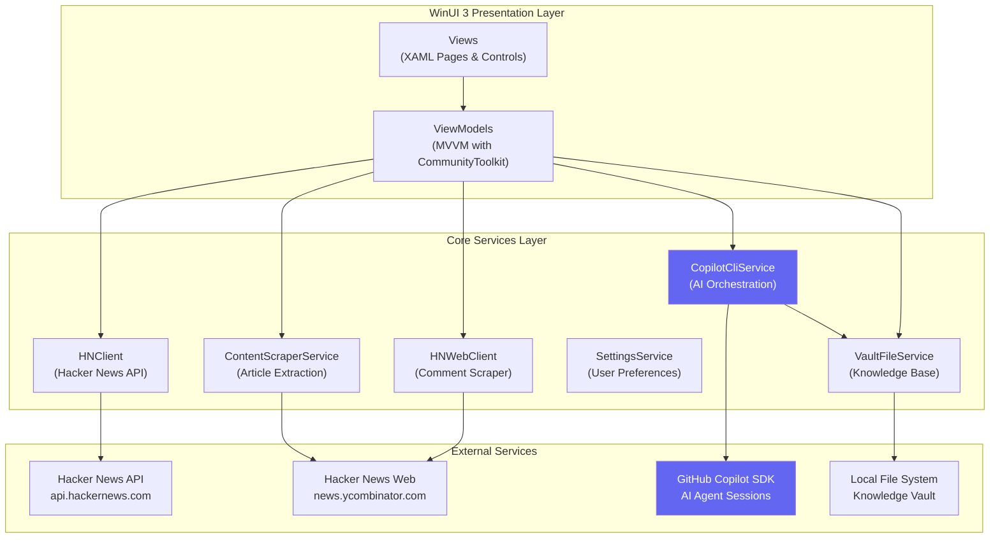

# HN Reader

A modern Hacker News reader for Windows, powered by **GitHub Copilot SDK** for AI-generated insights and personalized news digests.


<!--  -->
*Screenshot placeholder: Main application view showing story list, detail view, and AI insights panel*

## Features

- **Browse Hacker News** — View Top, New, Best, Ask HN, and Show HN stories with real-time updates
- **AI-Powered Insights** — Generate structured analysis of stories and discussions using GitHub Copilot
- **Personalized News Digest** — AI-curated daily digest based on your configured interests
- **Comment Threading** — Web-scraped comments with collapsible thread navigation
- **Favorites** — Save stories for later reading
- **Modern UI** — WinUI 3 design with light/dark theme support
- **Knowledge Vault** — Local storage of story markdown files for AI agent access

## Architecture



*Architecture diagram placeholder: Create a visual diagram based on the Mermaid flowchart above*

<!--  -->

## GitHub Copilot SDK Integration

HN Reader leverages the **GitHub Copilot SDK** to provide intelligent AI features:

### How It Works

1. **Story Markdown Generation** — When you request insights, the app scrapes the article content and comments, then saves them as a structured markdown file in your Knowledge Vault.

2. **AI Agent Sessions** — The app creates ephemeral Copilot sessions with:
   - Sandboxed file access (read/write only within the vault folder)
   - Non-streaming completion for story insights
   - Streaming progress for news digest generation
   - Permission-controlled file operations

3. **News Digest Pipeline** — The digest agent:
   - Reads unprocessed story data from the vault
   - Applies your configured interests to group and rank stories
   - Generates a personalized JSON digest with trending scores

### Benefits

- **Privacy-First** — AI agents only access files in your designated vault folder
- **Offline Context** — Story content is cached locally for analysis
- **Customizable** — Configure your interests and preferred AI model
- **Transparent** — Progress updates show exactly what the AI is doing

### Supported Models

| Model | Provider |
|-------|----------|
| Claude Sonnet 4.5 | Anthropic (default) |
| Claude Opus 4.5 | Anthropic |
| GPT-5.2 | OpenAI |

## Getting Started

### Prerequisites

- **Windows 10/11** (version 1809 or later)
- **.NET 8.0 SDK** — [Download](https://dotnet.microsoft.com/download/dotnet/8.0)
- **GitHub Copilot CLI** — Required for AI features. [Installation guide](https://docs.github.com/en/copilot/concepts/agents/about-copilot-cli)
- **Visual Studio 2022** (recommended) with:
  - .NET Desktop Development workload
  - Windows App SDK

### Build & Run

```powershell
# Clone the repository
git clone https://github.com/ZadokJoshua/hn-reader.git
cd hn-reader/HNReaderApp

# Restore dependencies
dotnet restore

# Build the solution
dotnet build

# Run the app
dotnet run --project src/HNReader.WinUI
```

Or open `HNReaderApp.sln` in Visual Studio and press F5.

### First-Time Setup

1. **Configure Knowledge Vault** — Open Settings and select a folder for your vault
2. **Add Interests** — Configure topics for your personalized news digest
3. **Verify Copilot CLI** — Ensure `copilot --version` works in your terminal

## Configuration

### Knowledge Vault

The Knowledge Vault is a local folder where HN Reader stores:

```
📁 YourVault/
├── 📁 news_digest/
│   ├── Agent.md                    # AI agent instructions
│   ├── unprocessed_data.json       # Raw story data for digest
│   └── digest.json                 # Generated digest output
└── 📁 stories/
    ├── Agent.md                    # AI agent instructions
    ├── 12345678.md                 # Story markdown files
    └── 87654321.md
```

[Learn more about Copilot CLI modes](https://docs.github.com/en/copilot/concepts/agents/about-copilot-cli#modes-of-use)

### User Interests

Add up to 5 interests to personalize your news digest:

| Interest | Description Example |
|----------|---------------------|
| AI/ML | Machine learning, neural networks, LLMs |
| Startups | Funding, acquisitions, founder stories |
| WebDev | Frontend, React, CSS, performance |

## Screenshots

<!-- 
Add screenshots here:
- Main view with story list
- Story detail with comments
- AI Insights panel
- News Digest view
- Settings page
-->

| Main View | AI Insights | Settings |
|-----------|-------------|----------|
| *placeholder* | *placeholder* | *placeholder* |

## Project Structure

```
HNReaderApp/
├── src/
│   ├── HNReader.Core/           # Core business logic
│   │   ├── Models/              # Data models
│   │   ├── Services/            # API clients, AI orchestration
│   │   ├── ViewModels/          # MVVM ViewModels
│   │   └── Helpers/             # Utilities
│   └── HNReader.WinUI/          # WinUI 3 presentation
│       ├── Views/               # XAML pages
│       ├── Controls/            # Custom controls
│       └── Converters/          # Value converters
└── README.md
```

## Contributing

Contributions are welcome! Please feel free to submit a Pull Request.

## License

This project is licensed under the MIT License - see the [LICENSE](LICENSE) file for details.

## Acknowledgments

- [Hacker News](https://news.ycombinator.com/) for the content API
- [GitHub Copilot SDK](https://github.com/github/copilot-sdk) for AI capabilities
- [CommunityToolkit.Mvvm](https://github.com/CommunityToolkit/dotnet) for MVVM infrastructure
- [Windows App SDK](https://github.com/microsoft/WindowsAppSDK) for WinUI 3