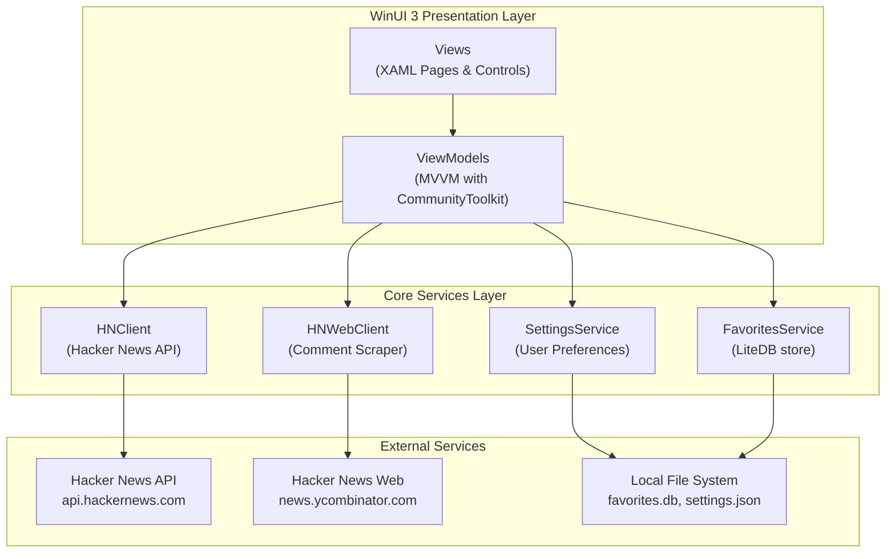

# HN Reader


A modern, fast Hacker News reader for Windows. No external services, no AI, no telemetry - just a clean WinUI 3 client for the stories you care about.


## Features

- **Browse Hacker News** — Top, New, Best, Ask HN, and Show HN feeds with paginated infinite scroll
- **Quick filters** — One-click toggle to show only Ask HN or only Show HN posts on any feed
- **Comment sorting** — Re-sort loaded comment threads by Top, New, or most-replied
- **Full comment threads** — Recursive reply tree parsed from the live HN site (faster than the official API)
- **Favorites** — Save stories locally with LiteDB; export/import as JSON for backup
- **In-place search** — Filter any list by title, author, or domain
- **Modern UI** — WinUI 3 with Mica backdrop, light/dark theme, and a custom title bar

## Architecture


```mermaid
flowchart TB
    subgraph UI["WinUI 3 Presentation Layer"]
        direction TB
        Views["Views<br/>(XAML Pages & Controls)"]
        ViewModels["ViewModels<br/>(MVVM with CommunityToolkit)"]
        Views --> ViewModels
    end

    subgraph Core["Core Services Layer"]
        direction TB
        HNClient["HNClient<br/>(Hacker News API)"]
        HNWebClient["HNWebClient<br/>(Comment Scraper)"]
        SettingsService["SettingsService<br/>(User Preferences)"]
        FavoritesService["FavoritesService<br/>(LiteDB store)"]
    end

    subgraph External["External Services"]
        HNAPI["Hacker News API<br/>api.hackernews.com"]
        HNWeb["Hacker News Web<br/>news.ycombinator.com"]
        LocalFS["Local File System<br/>favorites.db, settings.json"]
    end

    ViewModels --> HNClient
    ViewModels --> HNWebClient
    ViewModels --> SettingsService
    ViewModels --> FavoritesService

    HNClient --> HNAPI
    HNWebClient --> HNWeb
    SettingsService --> LocalFS
    FavoritesService --> LocalFS
```

## Getting Started

### Prerequisites

- **Windows 10/11** (version 1809 or later)
- **.NET 8.0 SDK** — [Download](https://dotnet.microsoft.com/download/dotnet/8.0)
- **Visual Studio 2022** (recommended) with:
  - .NET Desktop Development workload
  - Windows App SDK

### Build & Run

```powershell
# Clone the repository
git clone https://github.com/ZadokJoshua/hn-reader.git
cd hn-reader/HNReaderApp

# Restore dependencies
dotnet restore

# Build the solution
dotnet build

# Run the app
dotnet run --project .\src\HNReader.WinUI\HNReader.WinUI.csproj -r win-x64
```

Or open `HNReaderApp.sln` in Visual Studio and press F5.

## Project Structure

```
src/
├── HNReader.Core/           # Core business logic
│   ├── Models/              # Data models
│   ├── Services/            # API clients, storage
│   ├── ViewModels/          # MVVM ViewModels
│   ├── Enums/               # ApplicationPages, StoryType, CommentSortMode
│   ├── Helpers/             # LRU cache, comment tree, HTML/Markdown helpers
│   └── Interfaces/          # Service contracts
└── HNReader.WinUI/          # WinUI 3 presentation
    ├── Views/               # XAML pages
    ├── Controls/            # Custom controls (StoriesPageControl)
    ├── Converters/          # Value converters
    ├── Services/            # NavigationService, ErrorDialogService
    └── Factories/           # PageFactory

tests/
├── HNReader.Core.Tests/         # Unit tests for core logic
├── HNReader.Integration.Tests/  # Integration test project
└── HNReader.WinUI.Tests/        # WinUI test project
```

## Keyboard Shortcuts (future)

- `j` / `k` — next/previous story in the list
- `o` — open story URL in default browser
- `c` — toggle comments
- `s` — toggle favorite
- `Ctrl+F` — focus search
